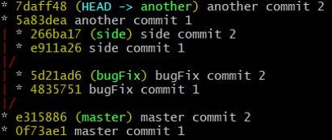
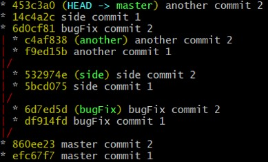

# Git exercise: Cherry-pick

## The Story

We want to pratice our skill with the git command cherry-pick

## Setup:

1.  Run  `. setup.sh` 
2.  Go into exercise/ folder

## Subject

Currently your commits look like this:&nbsp;

But you want it to look like this:&nbsp;

## Useful Commands

-   `git cherry-pick`