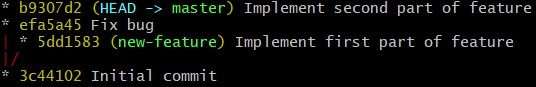
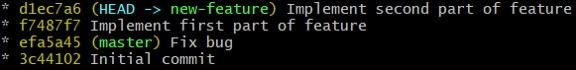

# Git exercise: Commit on wrong branch II

## The Story

You develop a new feature on the branch  `new-feature`. You have already implemented the first part of a feature, when you are notified of a critical bug that has to be fixed right away on the  `master`  branch.

After the bug fix, you continue to work on the new feature. After you committed the second part of the feature, you realize that you have done your commit on the  `master`  branch instead of the feature branch.

## Setup:

1.  Run  `. setup.sh` 
2. Go into exercise/ folder

## Subject

Currently your commits look like this:

But you want it to look like this:

## Useful Commands

-   `git reset HEAD~1`  to move the current branch one step back. This has the consequence of  _removing_  the newest commit from a branch
-   `git stash`  to temporarily save your changes so that you can switch branches
-   `git cherry-pick`  to add changeset from commit on current branch