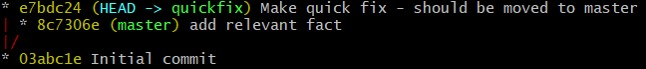
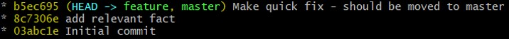

# Git exercise - Commit on wrong branch

## Setup
1. Run `. setup.sh`
2. Go into exercise/ folder

## Subject
You are working really hard on the master branch. Part of your work is already committed. This is when your boss comes in with an urgent request.

Since your current HEAD is not ready for prime time, you backup one commit, and start a new branch named 'quickfix'. You do whatever your boss wants and commit the changes to that new branch.

That's when you realize you created a minor mess with your branches.

Currently your commits look like this:

But you want it to look like this:

## Useful commands

-   `git log --oneline --graph --all`
-   `git checkout <branch-name>`
-   `git rebase <branch-name>`
-   `git branch <branch-name>`
-   `git reset --soft HEAD~`
-   `git branch -d <branch-name>`
-   `git merge <branch-name>`