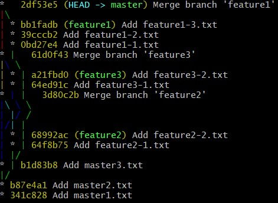
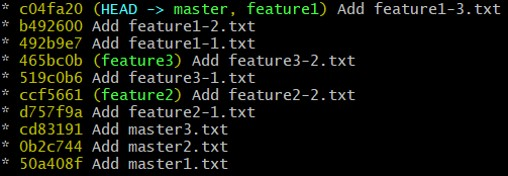

# Git exercise: Find tree history

## The Story

We want to compare a commits tree created with merge strategy and rebase strategy

## Subject

Try to find exactly the history of commits and merges made in this tree.

##### Tree created with merge strategy

##### Tree created with rebase strategy

- Which tree is the most simple to read ?
- Which tree guarantee me to have a non rewrite tree history