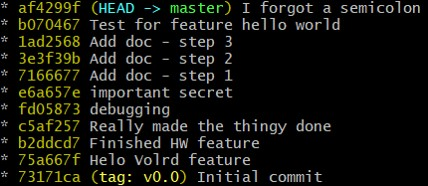
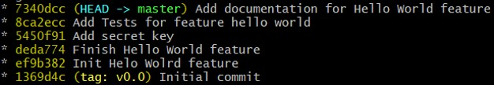

# Git exercise: Interactive rebase

You have worked on a new feature called Hello World.
This features ends up being complete with both documentation and unit test, but there are a few problems.
The history looks really messy, with lots of small half-finished steps, and there are things included that should never have been there.

You should fix this such that your `git log` looks great!

To do this we will use our good friend `git rebase --interactive`

Luckily we have a release tag `v0.0` from just before we started the feature.

As this is an advanced exercise, there are no specific steps to follow and no single solution.

## Setup:

1. Run `. setup.sh`
2. Go into exercise/ folder

## Task

Currently your commits look like this:

But you want it to look like this:

### useful commands

- `ls -l`                 # list files
- `tail -n +1 *`          # show content of all files
- `git log --oneline`     # show history
- `git log --stat`        # log which files changed
- `git log --patch`       # log with diff
- `git rebase -i <ref>`   # run the interactive rebase back to <ref>
