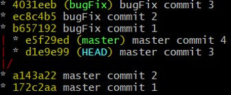
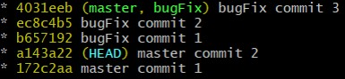

# Git exercise: Relative reference

## The Story

We want to pratice our skill with relative reference.

## Setup:

1.  Run  `. setup.sh` 
2.  Go into exercise/ folder

## Subject

Currently your commits look like this

But you want it to look like this:

## Useful Commands

-   `git branch -f`
-   `git checkout`