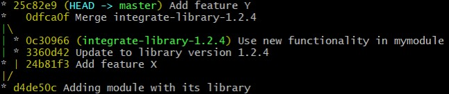
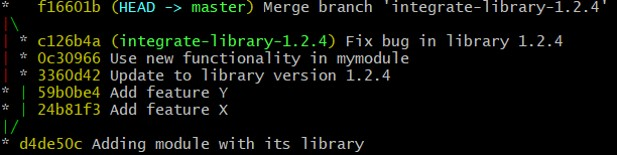

# Git exercise: Reverted merge

In this kata, we explore the problems of reverting merge commit.

## The story

Your team uses this amazing library-1.2.3 for its development, which is maintained by another team.

At some point, your team integrates a new version library-1.2.4. Because you are prudent, you do this on a branch  `integrate-library-1.2.4`.

Unfortunately, you discover after your merge that the library has a bug, which has to be fixed by this other team. To prevent the bug from being released into production, you decide to revert the merge commit.

## Setup

1.  Run  `. setup.sh`
2.  Go into exercise/ folder

## Subject

Currently your commits look like this:

We consider that the Y feature is also compatible with library 1.2.3. So we want to keep it.
During this exercice take the role of the library team and fix the bug in the library on the integrate branch, e.g. change  `lib.txt`.

At the end you want your commits tree looks like this:

## Useful commands

-   `git revert -m 1 <merge-sha1>`
-   `git log --oneline --graph --all`
-   `git add <file-name>`
-   `git revert --continue`
-   `git checkout <branch-name>`
-   `git merge <branch-name>`
-   `git reset --hard <sha1>`
-   `git revert <sha1>`